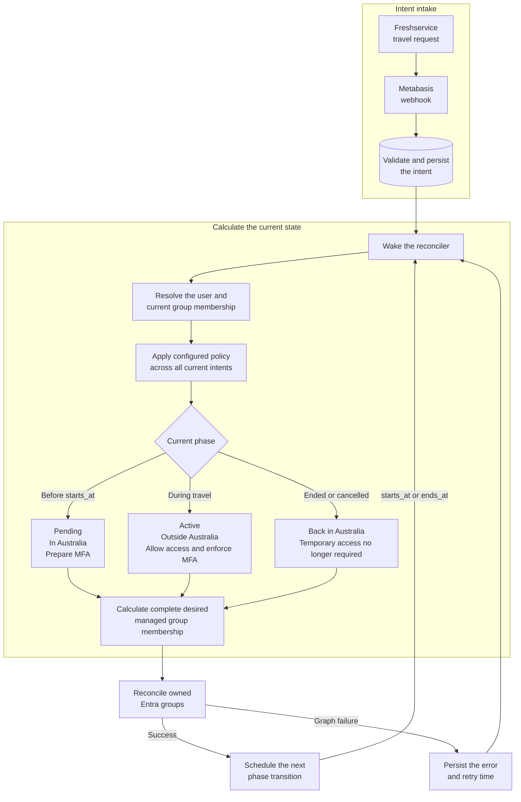

# metabasis

> **μετάβασις** (_metábasis_) — “transition; passage across”

Reconciles temporary Microsoft Entra group membership from webhook-driven intents and scheduled transitions.

Metabasis accepts a small canonical intent, persists it in PostgreSQL, derives its current temporal phase, and applies only the Entra groups declared in `managed_groups`. Configuration owns the identity rules; the scheduler only decides when to recalculate them.



## Usage

Start from [`config.example.yaml`](config.example.yaml). If `config.yaml` is present in the current directory, `--config` may be omitted:

```bash
metabasis validate
metabasis plan --event request.json
metabasis run

metabasis intents list
metabasis intents show freshservice SR-12345
metabasis reconcile --subject student@example.com
metabasis reconcile --all
```

Multiple `--config` flags apply overlays in order. Mappings merge recursively; lists and scalar values replace earlier values. Configuration is strict, and environment placeholders must occupy a whole YAML value such as `${MICROSOFT_CLIENT_SECRET}`.

The canonical webhook body is:

```json
{
  "id": "SR-12345",
  "subject": "student@example.com",
  "starts_at": "2026-09-12T08:00:00+10:00",
  "ends_at": "2026-09-27T18:00:00+10:00",
  "cancelled": false
}
```

Each configured webhook source uses bearer authentication. Repeated `(source, id)` deliveries replace the stored intent and wake reconciliation immediately.

## Reconciliation

The first matching CEL rule owns a subject. Pending and active intents contribute their configured groups; Metabasis unions those groups across overlapping intents before calculating the membership diff. Ended and cancelled intents contribute no groups.

Only groups declared under `managed_groups` can be added or removed. Other Entra membership is neither mirrored nor modified. Graph failures leave the accepted intent intact and persist retry state.

`plan` is read-only. It overlays the supplied event on persisted intents and shows the resolved user, matched rule, phases, desired groups, current managed membership, diff, and next transition.

## HTTP

`run` serves only configured `/webhooks/...` paths plus:

- `/healthz`
- `/readyz`

There is no Web UI or administrator login.

## Deployment from ADOverseas v2

Version 3 uses a fresh PostgreSQL schema. Existing v2 schedules are not migrated and must be resubmitted as canonical intents during deployment. Rename the GitHub repository to `woodleighschool/metabasis`, update the Freshservice webhook path and JSON body, deploy the `ghcr.io/woodleighschool/metabasis` image, and mount the new YAML configuration.

## Development

Mise owns the toolchain and repository checks:

```bash
mise run build
mise run generate
mise run test
mise run test-postgres
mise run lint
mise run fmt-check
mise run workflow-lint
```

PostgreSQL tests require `METABASIS_TEST_DATABASE_URL`. Tests use synthetic identities and local HTTP servers; real Graph credentials are not required.

## License

Licensed under the [Apache License 2.0](LICENSE).
