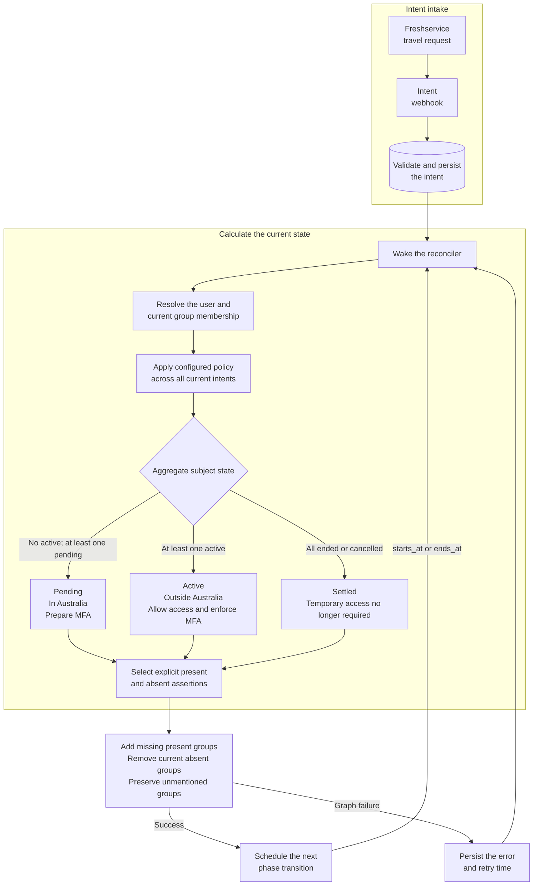

# metabasis

> **μετάβασις** (_metábasis_) — “transition; passage across”

Reconciles temporary Microsoft Entra group membership from webhook-driven intents and scheduled transitions.

Accepts a small canonical intent, persists it in PostgreSQL, derives the subject's aggregate temporal state, and applies only the Entra group membership assertions selected by configuration. The scheduler only decides when to recalculate them.



## Usage

Start from [`config.example.yaml`](config.example.yaml). If `config.yaml` is present in the current directory, `--config` may be omitted:

```bash
metabasis validate
metabasis plan --event request.json
metabasis run

metabasis intents list
metabasis intents show freshservice SR-12345
metabasis reconcile --subject student@example.com
metabasis reconcile --all
```

Multiple `--config` flags apply overlays in order. Mappings merge recursively; lists and scalar values replace earlier values. Configuration is strict, and environment placeholders must occupy a whole YAML value such as `${MICROSOFT_CLIENT_SECRET}`.

The published container runs the service from a mounted policy and app-prefixed environment:

```bash
docker run --rm \
  --env-file .env \
  --volume "$PWD/config.yaml:/config.yaml:ro" \
  ghcr.io/woodleighschool/metabasis:rolling
```

Runtime settings resolve from `METABASIS_*` environment variables, then the corresponding YAML value, then the default. CLI flags select configuration files or command behaviour rather than mirroring runtime settings.

| Environment variable                          | YAML fallback                       | Default  |
| --------------------------------------------- | ----------------------------------- | -------- |
| `METABASIS_LOG_LEVEL`                         | `log_level`                         | `info`   |
| `METABASIS_LISTEN`                            | `listen`                            | `:8080`  |
| `METABASIS_METRICS_LISTEN`                    | `metrics_listen`                    | `:8081`  |
| `METABASIS_DATABASE_URL`                      | `database.url`                      | required |
| `METABASIS_DATABASE_MIN_CONNECTIONS`          | `database.min_connections`          | `0`      |
| `METABASIS_DATABASE_MAX_CONNECTIONS`          | `database.max_connections`          | `10`     |
| `METABASIS_DATABASE_MAX_CONNECTION_LIFETIME`  | `database.max_connection_lifetime`  | `30m`    |
| `METABASIS_DATABASE_MAX_CONNECTION_IDLE_TIME` | `database.max_connection_idle_time` | `5m`     |
| `METABASIS_DATABASE_HEALTH_CHECK_PERIOD`      | `database.health_check_period`      | `1m`     |
| `METABASIS_RECONCILE_POLL_INTERVAL`           | `reconcile.poll_interval`           | `1m`     |
| `METABASIS_RECONCILE_RETRY_INITIAL`           | `reconcile.retry_initial`           | `30s`    |
| `METABASIS_RECONCILE_RETRY_MAX`               | `reconcile.retry_max`               | `15m`    |

Daemon mode writes structured JSON to stderr. Lifecycle and material reconciliation events use `info`, warnings and failures use `warn` or `error`, and successful cycle summaries plus routine no-op evaluations use `debug`.

The canonical webhook body is:

```json
{
  "id": "SR-12345",
  "subject": "student@example.com",
  "starts_at": "2026-09-12T08:00:00+10:00",
  "ends_at": "2026-09-27T18:00:00+10:00",
  "cancelled": false
}
```

Each configured webhook source uses bearer authentication. Repeated `(source, id)` deliveries replace the stored intent and wake reconciliation immediately.

## Reconciliation

The first matching CEL rule applies to a subject. The service selects one aggregate state across all known intents: active takes precedence over pending, while settled means every known intent has ended or was cancelled. A subject with no known intents produces no membership assertions.

`identity.groups` maps provider group IDs to aliases available to CEL and membership assertions. `present` adds a missing membership, `absent` removes an existing membership, and an unmentioned alias is preserved. Writable aliases must resolve to exactly one group ID. Adds are attempted before removals; Graph failures leave the accepted intent intact and persist retry state.

`plan` is read-only. It overlays the supplied event on persisted intents and shows the resolved user, matched rule, aggregate state, intent phases, present and absent assertions, current aliases, diff, and next transition.

## HTTP

`run` serves configured `/webhooks/...` paths plus:

- `/healthz`
- `/readyz`

The `metrics_listen` address (default `:8081`) serves `/metrics`. It includes standard Go/process metrics and bounded service metrics for build information, webhook results, reconciliation results and duration, current intent phases, failed subjects, due subjects, and database state-collection success.

Database-derived gauges are collected at scrape time. If that query fails, `/metrics` remains available, `metabasis_state_collection_success` is `0`, the stale database gauges are omitted, and the database error is logged.

Read-only `intents` commands may run alongside the service. Webhook updates and reconciliation are serialized per subject through PostgreSQL advisory locks.

## Development

Mise owns the toolchain and repository checks:

```bash
mise run build
mise run generate
mise run test
mise run test-postgres
mise run lint
mise run fmt-check
mise run workflow-lint
```

PostgreSQL tests require `METABASIS_TEST_DATABASE_URL`. Tests use synthetic identities and local HTTP servers; real Graph credentials are not required.

## License

Licensed under the [Apache License 2.0](LICENSE).
